````markdown
# FlooFIX

A modern C++20 FIX protocol parsing and validation core designed with
low-latency systems principles, predictable memory usage, cache-friendly
data structures, and minimal dynamic allocation in mind.

> **Current version:** `v0.2.0`
>
> FlooFIX is currently a FIX parsing/validation core. Networking, FIX session
> management, message encoding, and production-grade I/O are planned for
> subsequent versions.

---

## Overview

FIX (Financial Information eXchange) is a tag-value based protocol commonly
used for communication between trading systems, brokers, exchanges, and
financial institutions.

A typical FIX message looks like:

```text
8=FIX.4.2|9=118|35=D|49=SENDER|56=TARGET|34=2|52=20240528-09:20:52|11=ORDERID|55=MSFT|54=1|38=1000|40=2|44=150.5|10=028|
````

where `|` represents the FIX SOH delimiter (`0x01`).

FlooFIX transforms this wire representation into a compact, fixed-capacity
in-memory representation:

```text
Raw FIX Message
      |
      v
+-------------+
|  Tokenizer  |
+-------------+
      |
      v
+-------------+
|    Parser   |
+-------------+
      |
      v
+----------------+
|  FixMessage    |
|                |
| Tag -> Value   |
+----------------+
      |
      v
+-------------+
|  Validator  |
+-------------+
      |
      v
ValidationResult
```

---

# Design Goals

FlooFIX is being developed around several principles.

### 1. C++20

Use modern C++ language and library facilities where they improve:

* type safety
* compile-time guarantees
* expressiveness
* performance
* ownership clarity

Examples include:

* `std::string_view`
* `std::array`
* `constexpr`
* `[[nodiscard]]`
* designated initialization
* `noexcept`
* fixed-width integer types
* compile-time configuration

---

### 2. Predictable memory usage

The core parser should avoid unnecessary dynamic allocation.

Instead of:

```cpp
std::vector<FixField>
std::unordered_map<int, std::string>
```

FlooFIX currently uses:

```cpp
template <std::size_t MaxFields = 64>
struct FixMessage {
    std::array<FixField, MaxFields> fields;
    std::uint16_t count;
};
```

This provides:

* fixed capacity
* contiguous storage
* predictable object size
* no per-field allocation
* cache-friendly sequential traversal

---

### 3. Non-owning field values

FIX field values are represented using:

```cpp
std::string_view
```

rather than copying the value into a new `std::string`.

Conceptually:

```text
Network / Input Buffer
+------------------------------------------------+
| 8=FIX.4.2^A35=D^A55=MSFT^A54=1^A...          |
+------------------------------------------------+
       ^              ^
       |              |
       +--------------+
          string_view
```

The parsed message refers to the original input buffer.

Therefore the input buffer must remain alive for as long as the
`FixMessage` is being used.

---

# Architecture

## Current architecture

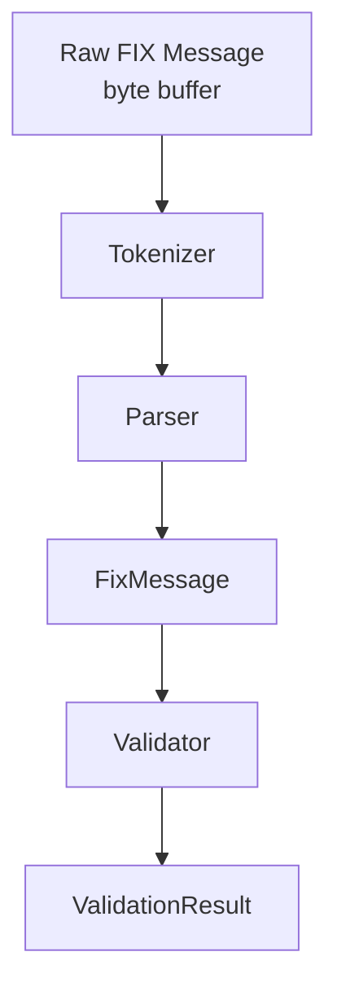

The core is deliberately separated into independent stages.

---

## Component responsibilities

| Component    | Responsibility                              |
| ------------ | ------------------------------------------- |
| `tokenizer`  | Locate FIX fields and delimiters            |
| `parser`     | Convert tokens into `FixMessage`            |
| `FixMessage` | Store parsed fields                         |
| `validator`  | Validate FIX message structure and checksum |
| `storage`    | Fixed-capacity field/message representation |
| `tests`      | Regression and correctness testing          |
| `benchmarks` | Performance and memory-layout measurements  |

---

# Project Structure

```text
FlooFIX/
│
├── CMakeLists.txt
│
├── inc/
│   ├── parser.hpp
│   ├── storage.hpp
│   ├── tokenizer.hpp
│   └── validator.hpp
│
├── src/
│   ├── parser.cpp
│   ├── tokenizer.cpp
│   └── validator.cpp
│
├── tests/
│   ├── CMakeLists.txt
│   ├── tokenizer_test.cpp
│   ├── parser_test.cpp
│   ├── validator_test.cpp
│   ├── storage_test.cpp
│   └── storage_layout_test.cpp
│
└── benchmarks/
    ├── CMakeLists.txt
    └── storage_bench.cpp
```

---

# Core Data Structures

## `FixField`

A single FIX field is represented as:

```cpp
struct FixField {
    Tag tag{0};
    std::string_view value{};

    [[nodiscard]] constexpr bool empty() const noexcept {
        return value.empty();
    }
};
```

A FIX field such as:

```text
55=MSFT
```

becomes conceptually:

```text
FixField
+-------------------------+
| tag   = 55              |
| value = "MSFT"          |
+-------------------------+
```

The `"MSFT"` string is not copied.

---

## `FixMessage`

The current message representation is:

```cpp
template <std::size_t MaxFields = 64>
struct FixMessage {
    std::array<FixField, MaxFields> fields{};
    std::uint16_t count{0};
};
```

Conceptually:

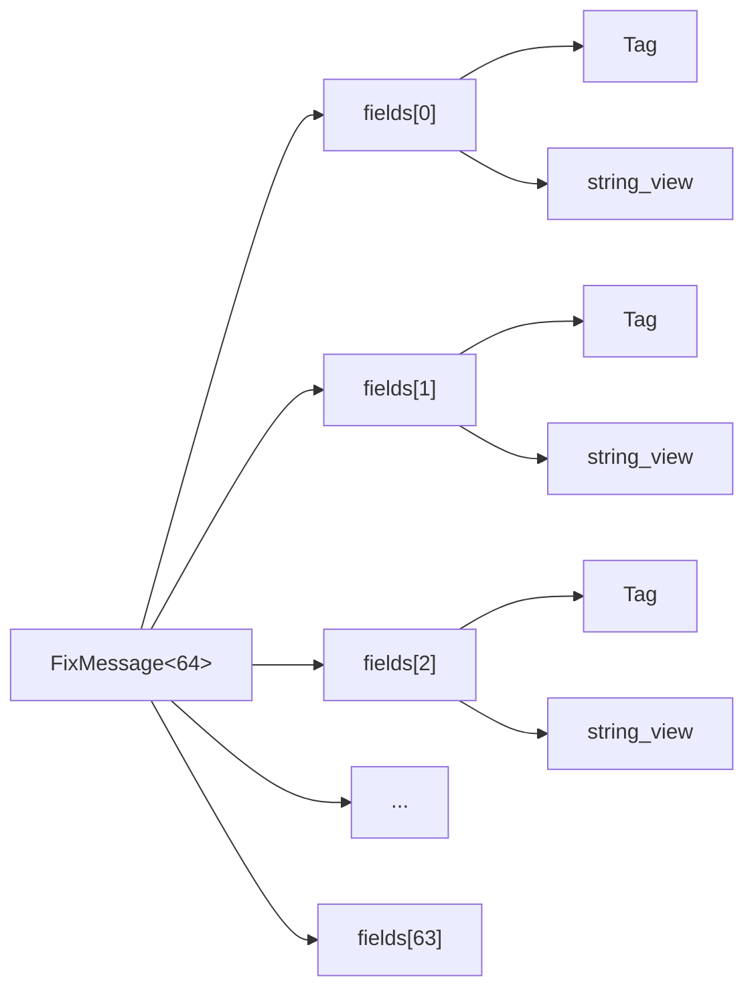

The important property is that the fields live in a contiguous
`std::array`.

---

# Why Not `std::unordered_map`?

A traditional implementation might use:

```cpp
std::unordered_map<int, std::string>
```

This is convenient, but it introduces several costs:

* dynamic allocation
* hash computation
* pointer chasing
* poor spatial locality
* larger memory footprint
* unpredictable access patterns

FlooFIX instead uses:

```cpp
std::array<FixField, MaxFields>
```

and performs a linear scan for tag lookup.

For a normal FIX message containing a relatively small number of fields,
this can be a reasonable trade-off.

```text
unordered_map

FixMessage
   |
   v
bucket array
   |
   +--> node
   |      |
   |      +--> string
   |
   +--> node
          |
          +--> string


FlooFIX

FixMessage
   |
   v
+------+------+------+------+------+-----+
| F0   | F1   | F2   | F3   | ... | F63 |
+------+------+------+------+------+-----+
```

The second representation has significantly better spatial locality.

---

# Memory Layout

One of the project's design goals is to understand how data layout affects
performance.

The current measurements on the development machine are:

```text
sizeof(FixField)       = 24 bytes
alignof(FixField)      = 8 bytes

sizeof(FixMessage<8>)  = 200 bytes
sizeof(FixMessage<64>) = 1544 bytes

alignof(FixMessage<64>) = 8 bytes
```

These measurements are intentionally tracked.

The goal is not to optimize based purely on intuition.

Instead:

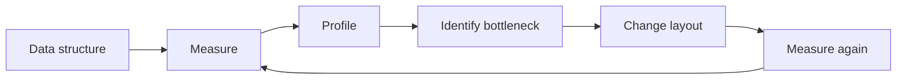

This creates a measurable optimization loop.

---

# Memory-Oriented Design

FlooFIX takes inspiration from the principles discussed in:

> **What Every Programmer Should Know About Memory**

The important principles being applied are:

### Spatial locality

Keep related data close together.

```cpp
std::array<FixField, 64>
```

provides contiguous storage.

---

### Temporal locality

Frequently accessed data should remain useful in nearby cache levels.

For example:

```cpp
message.find(55);
message.find(54);
message.find(38);
```

operates over the same small contiguous data structure.

---

### Avoid unnecessary allocations

Instead of:

```cpp
std::string value = token;
```

the parser can retain:

```cpp
std::string_view value;
```

when ownership is not required.

---

### Reduce pointer chasing

Pointer-heavy structures such as:

```text
hash table
    |
    v
heap node
    |
    v
heap string
```

can cause additional cache misses.

FlooFIX prefers compact contiguous structures where practical.

---

# Tokenization

The tokenizer's job is to identify FIX fields.

For:

```text
35=D^A55=MSFT^A54=1^A
```

the tokenizer identifies:

```text
35=D
55=MSFT
54=1
```

without requiring every field to become an owning string.

Conceptually:

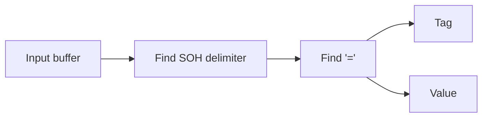

---

# Parsing

The parser converts tokenized fields into the fixed-capacity message:

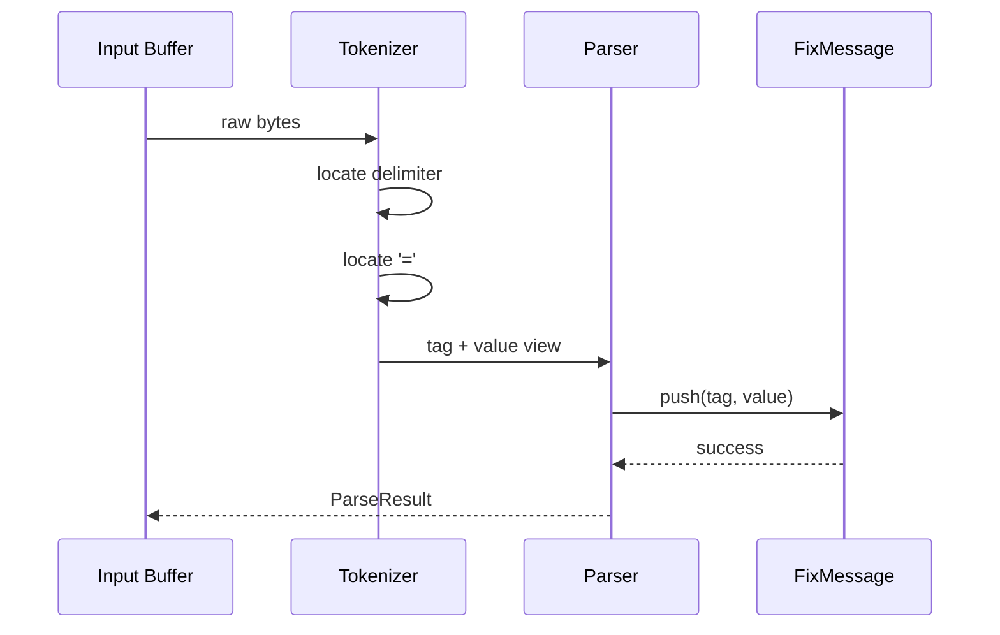

No field-level `std::string` allocation is required by the core representation.

---

# Validation

Validation occurs after parsing.

Current validation includes checks around:

* message structure
* required header fields
* message type
* body requirements
* checksum
* malformed fields

The validation flow is:

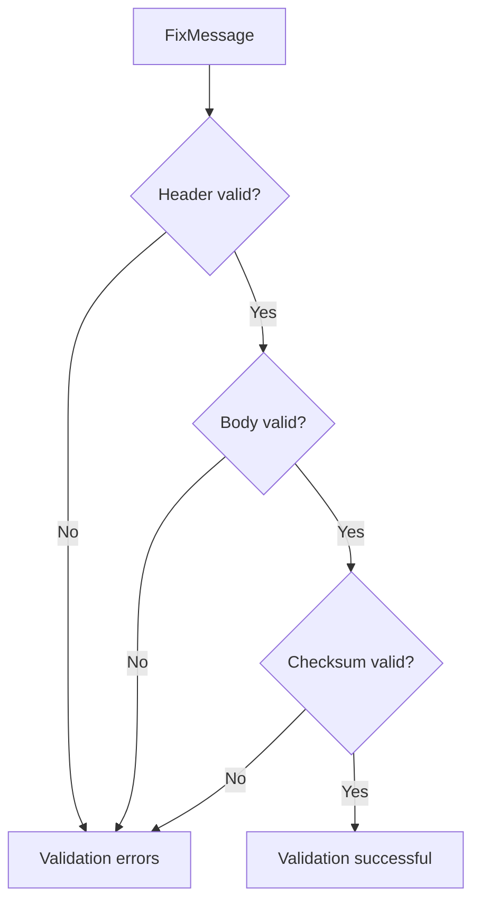

---

# Error Handling

The project uses explicit result structures instead of exceptions for
normal parsing/validation failures.

Example:

```cpp
struct ParseError {
    enum class Code : std::uint8_t {
        None,
        TooManyFields,
        InvalidTag,
        EmptyTag,
        MissingDelimiter
    };

    Code code{Code::None};
    std::size_t position{0};

    [[nodiscard]] constexpr bool ok() const noexcept {
        return code == Code::None;
    }
};
```

This makes expected protocol errors explicit and avoids using exceptions
as normal control flow.

---

# Testing

FlooFIX uses CTest through CMake.

Current test suites:

```text
floofix_tokenizer_tests
floofix_parser_tests
floofix_validator_tests
floofix_storage_tests
floofix_storage_layout_tests
```

Current status:

```text
5/5 tests passed
0 tests failed
```

Run the tests with:

```bash
ctest --test-dir build --output-on-failure
```

---

# Building

## Requirements

* C++20 compiler
* CMake
* Make/Ninja
* Linux, Windows, or another supported platform

The project is currently being developed primarily with GCC on Linux.

---

## Configure

```bash
cmake -S . -B build
```

---

## Build

```bash
cmake --build build -j$(nproc)
```

---

# Build With Tests

Tests are enabled by default.

```bash
cmake -S . -B build \
    -DFLOOFIX_BUILD_TESTS=ON
```

Build:

```bash
cmake --build build -j$(nproc)
```

Run:

```bash
ctest --test-dir build --output-on-failure
```

---

# Build With Benchmarks

Enable benchmarks:

```bash
cmake -S . -B build \
    -DFLOOFIX_BUILD_TESTS=ON \
    -DFLOOFIX_BUILD_BENCHMARKS=ON
```

Build:

```bash
cmake --build build -j$(nproc)
```

Run the current storage benchmark:

```bash
./build/benchmarks/floofix_storage_bench
```

---

# Current Benchmark Baseline

The current storage microbenchmark reports approximately:

| Operation                 | ns/op |
| ------------------------- | ----: |
| `FixMessage` construction |  2.23 |
| Push 12 fields            |  2.28 |
| Iterate 12 fields         |  8.58 |
| Find tag 55               |  7.42 |
| Get tag 55                |  7.34 |
| Construct 1 field         |  2.08 |
| Construct 4 fields        |  1.87 |
| Construct 8 fields        |  1.88 |
| Construct 12 fields       |  1.88 |

These are **development-machine microbenchmark results**, not guaranteed
production latency numbers.

They exist primarily as a regression baseline.

---

# Benchmark Philosophy

Performance work in FlooFIX follows:

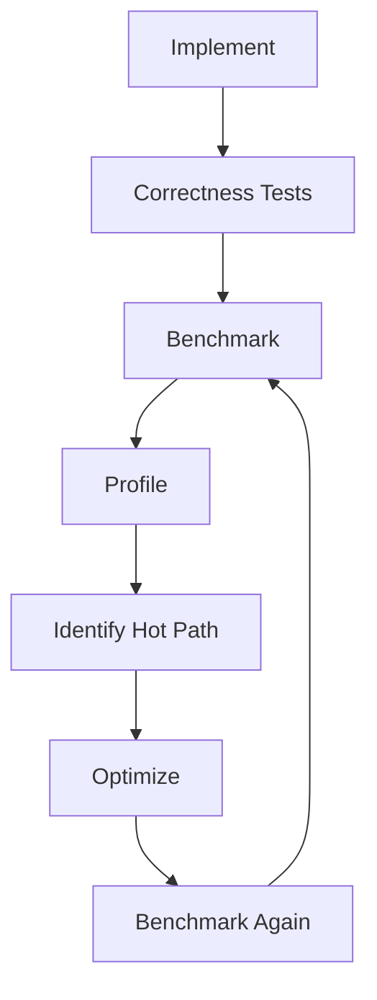

We do not assume that a particular C++ construct is faster.

We measure it.

---

# Current Limitations

FlooFIX is **not yet a complete FIX engine**.

The following components are not currently implemented:

* TCP networking
* asynchronous I/O
* FIX session management
* Logon/Logout
* Heartbeat/TestRequest
* sequence number management
* ResendRequest
* SequenceReset
* Reject handling
* message encoding
* BodyLength generation
* CheckSum generation
* repeating FIX groups
* production connection management

The current executable is primarily a development/demo target.

---

# Planned Architecture

The long-term architecture is:

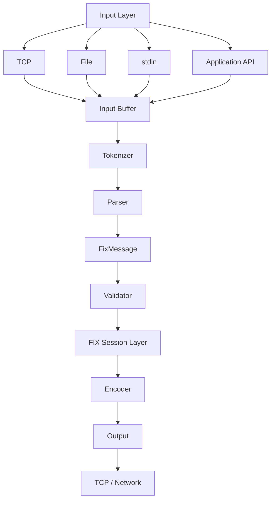

The key architectural principle is that the parser should not care whether
the bytes came from:

* a socket
* a file
* stdin
* another application
* a benchmark

All inputs should eventually feed the same core parsing interface.

---

# Future Performance Architecture

The eventual low-latency pipeline is intended to look like:

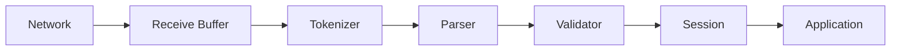

The performance objectives are:

* minimize allocations
* minimize copying
* improve cache locality
* reduce pointer chasing
* maintain predictable object lifetimes
* minimize unnecessary branches
* keep hot data compact
* avoid unnecessary synchronization
* measure cache behavior rather than guessing
* benchmark complete hot paths

---

# Memory Ownership Model

An important property of the current design is that parsed fields can refer
to the original input buffer.

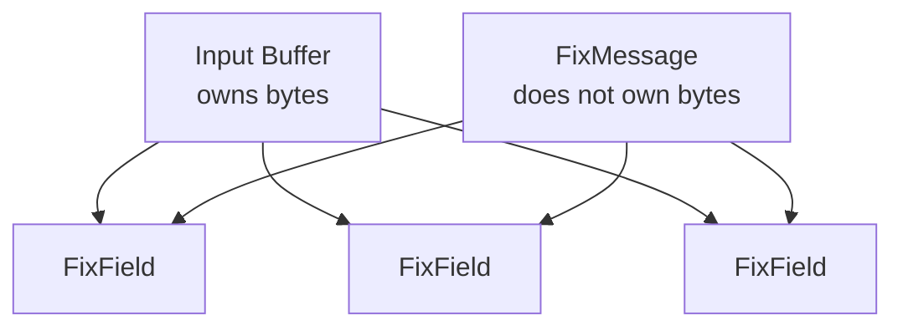

Therefore:

```text
Input buffer lifetime
        >=
FixMessage lifetime
```

The message must not outlive the storage referenced by its `string_view`s.

This ownership rule is fundamental to the zero-copy design.

---

# Why Fixed-Capacity Storage?

A FIX message usually contains a relatively small number of fields.

Using:

```cpp
FixMessage<64>
```

gives a deterministic upper bound.

Advantages:

```text
No dynamic growth
No vector reallocation
No per-field allocation
Contiguous memory
Predictable layout
```

Trade-off:

```text
More memory reserved than strictly necessary
Maximum field count is bounded
```

The correct capacity will eventually be determined using real workloads
rather than arbitrary assumptions.

---

# Version History

## v0.2.0

Current development milestone.

### Core

* C++20 parsing architecture
* FIX tokenizer
* FIX parser
* FIX validator
* fixed-capacity `FixMessage`
* non-owning `std::string_view` field values
* explicit parsing errors
* explicit validation results

### Testing

* tokenizer tests
* parser tests
* validator tests
* storage tests
* memory-layout tests
* CTest integration

### Performance

* initial storage benchmark suite
* object-size measurements
* alignment measurements
* baseline microbenchmarks

### Build

* CMake
* optional tests
* optional benchmarks
* optional sanitizer configuration

---

# Roadmap

## v0.3.0 — Input Layer

```text
stdin
file
buffer API
```

Goal:

Remove the dependency on hardcoded demo messages.

---

## v0.4.0 — FIX Encoder

Implement:

```text
FixMessage
    |
    +--> BodyLength
    |
    +--> fields
    |
    +--> CheckSum
    |
    v
wire-format FIX message
```

---

## v0.5.0 — Session Layer

Implement:

* Logon
* Logout
* Heartbeat
* TestRequest
* sequence numbers
* Reject
* ResendRequest
* SequenceReset

---

## v0.6.0 — Networking

Add:

* TCP transport
* receive buffers
* send buffers
* message framing
* connection lifecycle

---

## v0.7.0 — Performance Engineering

Measure:

* allocations
* cache misses
* branch misses
* instructions
* cycles
* memory bandwidth
* latency distributions

Tools may include:

```text
perf
valgrind
heaptrack
cachegrind
Compiler Explorer
```

---

## v1.0.0 — FIX Engine

Target:

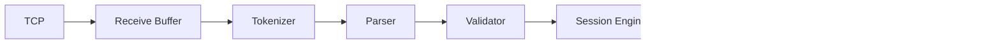

The goal is a complete, tested, benchmarked, production-oriented FIX
engine rather than simply a FIX parser.

---

# Development Principles

FlooFIX follows a few rules during development.

### Correctness before optimization

```text
Correct
  ↓
Test
  ↓
Measure
  ↓
Optimize
  ↓
Measure again
```

### Don't optimize based on syntax

Modern C++ does not automatically mean faster C++.

For example:

```cpp
std::unordered_map
```

is not inherently bad.

And:

```cpp
std::array
```

is not inherently fast.

The important question is how the resulting machine code interacts with:

* CPU caches
* branch prediction
* memory hierarchy
* allocation behavior
* workload characteristics

Therefore performance changes should be benchmarked.

---

# Contributing

Before submitting changes:

```bash
cmake -S . -B build \
    -DFLOOFIX_BUILD_TESTS=ON \
    -DFLOOFIX_BUILD_BENCHMARKS=ON

cmake --build build -j$(nproc)

ctest --test-dir build --output-on-failure
```

Performance-sensitive changes should include benchmark results whenever
possible.

---

# License

Add the project's license here.

---

# Status

FlooFIX is an actively developed C++20 systems project.

Current focus:

```text
FIX parsing
     ↓
FIX validation
     ↓
memory-efficient storage
     ↓
input abstraction
     ↓
FIX encoding
     ↓
session management
     ↓
networking
     ↓
performance engineering
```

The current `v0.2.0` milestone establishes the parsing, validation,
testing, and initial performance-measurement foundation.

