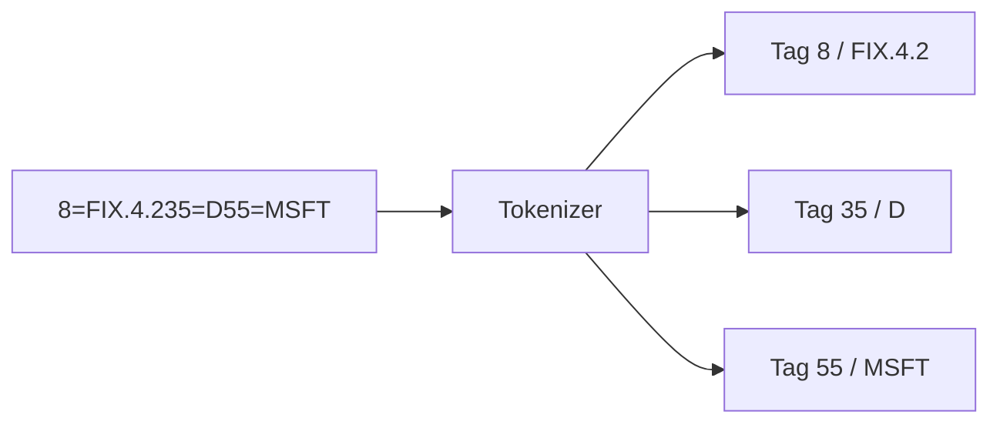
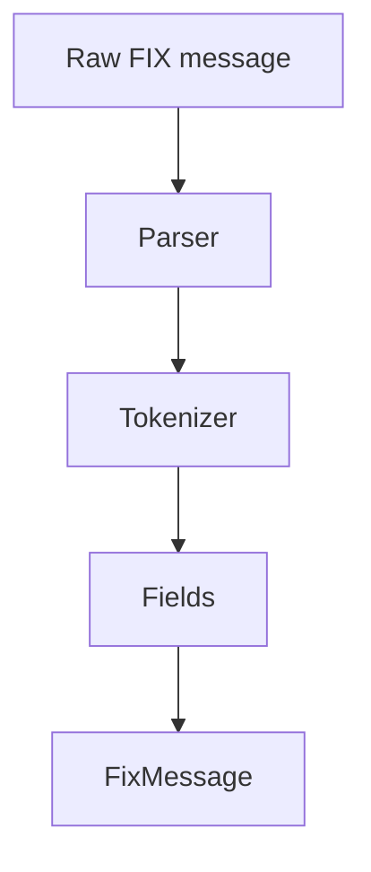
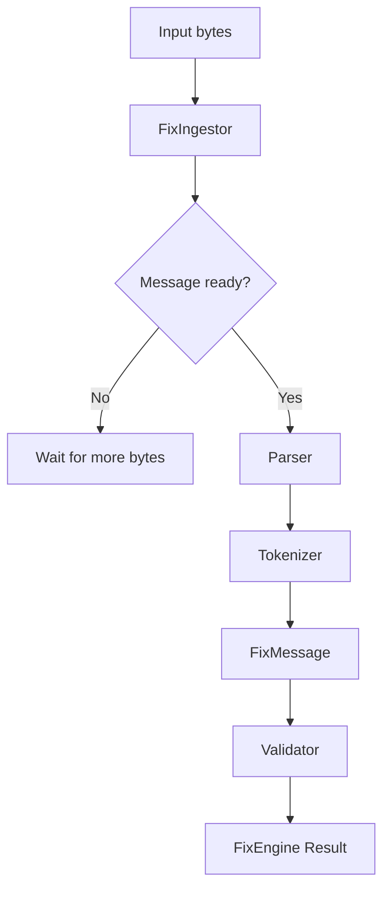
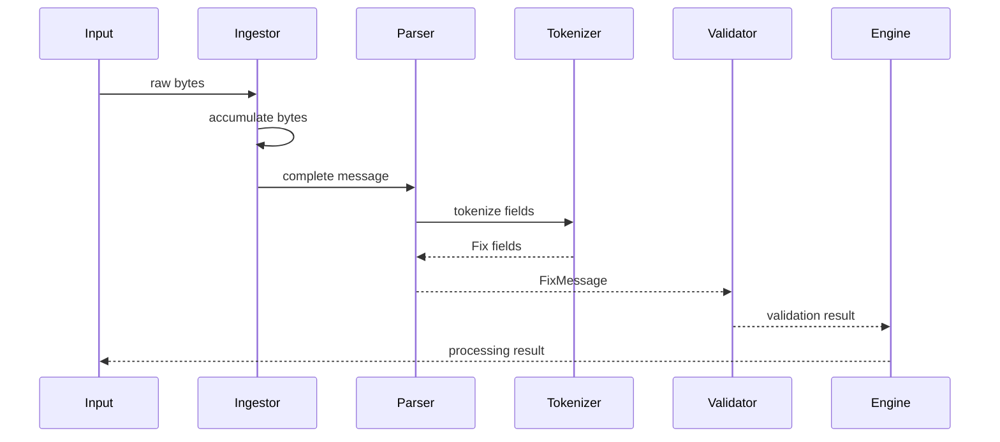
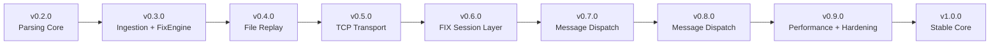

````markdown
# FlooFIX

A lightweight, allocation-conscious FIX protocol parsing and validation
engine written in modern C++20.

FlooFIX is being built from the ground up with a focus on:

- deterministic parsing
- bounded memory usage
- incremental data ingestion
- zero-copy field representation where practical
- explicit validation
- simple, composable components
- performance measurement

> **Status:** Active development — v0.5.0

FlooFIX provides a robust FIX message parsing, ingestion, validation, and TCP transport core.
It includes enhanced error reporting, formatting utilities, and duplicate tag detection.
It is **not yet a complete FIX session engine** and should not be considered
production-ready for trading systems without additional development.

---

## Architecture

The current processing pipeline is:

```mermaid
flowchart LR

    A[Raw FIX bytes] --> B[Ingestion Buffer]

    B --> C[FixIngestor]

    C --> D{Complete FIX message?}

    D -->|No| C
    D -->|Yes| E[Parser]

    E --> F[Tokenizer]

    F --> G[FixMessage]

    G --> H[Validator]

    H --> I[FixEngine]

    I --> J[Parsed + Validation Result]
````

The important design principle is that the ingestion layer operates on bytes
rather than assuming a particular transport.

This allows the same core to consume data from:

```mermaid
flowchart TD

    A[TCP Socket]
    B[File Replay]
    C[Memory Buffer]
    D[Test Data]

    A --> E[Byte Stream]
    B --> E
    C --> E
    D --> E

    E --> F[FixIngestor]
    F --> G[FixEngine]
```

**TCP transport is now implemented** with a multi-threaded server supporting concurrent connections, message validation, and real-time statistics tracking. File replay is planned for a future release.

---

# Features

## ✅ Implemented Features

### Core Parsing & Validation
- [x] FIX message representation with tag/value storage
- [x] Tokenization with SOH delimiter support
- [x] Parsing functionality with `FixMessage` conversion
- [x] **Body length validation** - validates BodyLength (tag 9) against actual message body
- [x] **Duplicate tag detection** - identifies and reports tags appearing multiple times
- [x] Validation with header/body/checksum verification
- [x] Incremental ingestion with `IngestionBuffer`

### Enhanced Error Reporting
- [x] Detailed `ValidationError` struct with:
  - Error message
  - Associated tag number
  - Position in raw message
  - Problematic field value
- [x] Helper methods for error extraction
- [x] Comprehensive validation result reporting

### Formatter Utilities
- [x] `format()` - Standard message formatting with header/body/trailer separation
- [x] `formatDetailed()` - Detailed view with tag names, types, and values
- [x] `formatValidationResult()` - Human-readable validation error reporting
- [x] `toReadableString()` - Convert messages to readable format
- [x] Field name and type identification

### TCP Data Ingestion
- [x] Multi-threaded TCP server (`TcpServer`)
- [x] Configurable host/port and connection limits
- [x] Concurrent client handling
- [x] Real-time message processing pipeline
- [x] Statistics tracking (messages received, validated, failures, connections)
- [x] Callback-based message handling
- [x] Graceful shutdown support

### FixEngine Orchestration
- [x] Complete processing pipeline integration
- [x] Status checking and result aggregation
- [x] Transport-agnostic design

---

## FIX Message Representation

FIX fields are represented using:

```cpp
struct FixField {
    Tag tag;
    std::string_view value;
};
```

A message uses fixed-capacity storage:

```cpp
template <std::size_t MaxFields = 64>
struct FixMessage;
```

This avoids dynamic allocation for the normal message representation.

Example:

```cpp
fix::FixMessage<> message;

message.push(35, "D");
message.push(55, "MSFT");
message.push(38, "1000");

auto type = message.get(35);
```

---

## Tokenization

The tokenizer separates a raw FIX message into tag/value fields using the
FIX SOH delimiter:

```text
8=FIX.4.2<SOH>
9=97<SOH>
35=D<SOH>
49=SENDER<SOH>
56=TARGET<SOH>
```

Conceptually:


```mermaid
flowchart LR

    A["8=FIX.4.2<SOH>35=D<SOH>55=MSFT<SOH>"]
        --> B[Tokenizer]

    B --> C["Tag 8 / FIX.4.2"]
    B --> D["Tag 35 / D"]
    B --> E["Tag 55 / MSFT"]
```

The tokenizer is deliberately kept separate from higher-level message
validation.

---

# Parser

The parser orchestrates tokenization and field extraction.


```mermaid
flowchart TD

    A[Raw FIX message]
        --> B[Parser]

    B --> C[Tokenizer]

    C --> D[Fields]

    D --> E[FixMessage]
```

The parser converts the wire representation into the internal
`FixMessage` representation.

---

# Validation

The validator operates on parsed FIX messages and checks protocol-level
conditions implemented by FlooFIX.

Validation errors are represented explicitly rather than thrown as exceptions.

Example:

```text
Validation errors:
    - ChecksumMismatch
    - ...
```

This makes validation suitable for low-level/high-throughput processing where
exceptions are undesirable in the normal message path.

---

# Incremental Ingestion

FlooFIX contains a bounded ingestion buffer designed for data arriving in
arbitrary chunks.

A FIX message does not need to arrive in one `feed()` call.

For example:

```text
TCP read #1
    |
    v
8=FIX.4.2<SOH>9=97<SOH>35=D
    |
    | incomplete
    v
wait for more data

TCP read #2
    |
    v
<SOH>49=SENDER<SOH>...<SOH>10=241<SOH>
    |
    v
complete FIX message
```

The ingestion layer reports states such as:

```cpp
fix::IngestionStatus::NeedMoreData
fix::IngestionStatus::MessageReady
fix::IngestionStatus::BufferFull
fix::IngestionStatus::InvalidMessage
```

This allows the same ingestion core to work with future TCP/file/replay
sources without coupling the parser to a specific transport.

---

# FixEngine

`FixEngine` is the orchestration layer connecting the individual components.


```mermaid
flowchart TD

    A[Input bytes]
        --> B[FixIngestor]

    B --> C{Message ready?}

    C -->|No| D[Wait for more bytes]

    C -->|Yes| E[Parser]

    E --> F[Tokenizer]

    F --> G[FixMessage]

    G --> H[Validator]

    H --> I[FixEngine Result]
```

The engine is intentionally kept separate from transport.

Future transport implementations can therefore feed bytes into the same
engine.

---

# Memory Model

The core data structures use bounded storage.

For example:

```cpp
template <std::size_t MaxFields = 64>
struct FixMessage;
```

and:

```cpp
template <std::size_t Capacity = 64 * 1024>
class IngestionBuffer;
```

This gives the application explicit upper bounds for:

* number of fields
* ingestion buffer size

The current implementation favors predictable memory behavior over
unbounded dynamic containers.

---

# Performance

FlooFIX contains dedicated benchmarks for the core data structures.

Example benchmark results from the development environment:

```text
FixMessage construction       ~2.23 ns/op
push 12 FIX fields            ~2.28 ns/op
iterate 12 FIX fields         ~8.58 ns/op
find tag 55                   ~7.42 ns/op
get tag 55                    ~7.34 ns/op
construct 1 field             ~2.08 ns/op
construct 4 fields            ~1.87 ns/op
construct 8 fields            ~1.88 ns/op
construct 12 fields           ~1.88 ns/op
```

These numbers are machine-dependent and are provided only as development
measurements, not performance guarantees.

Run the benchmarks yourself before making performance comparisons.

---

# Project Structure

```text
FlooFIX/
│
├── CMakeLists.txt
├── README.md
├── main.cpp
│
├── inc/
│   ├── fix_constant.hpp
│   ├── ingestion.hpp
│   ├── parser.hpp
│   ├── storage.hpp
│   ├── tokenizer.hpp
│   ├── validator.hpp
│   └── fix_engine.hpp
│
├── src/
│   ├── ingestion.cpp
│   ├── parser.cpp
│   ├── tokenizer.cpp
│   ├── validator.cpp
│   └── fix_engine.cpp
│
├── tests/
│   ├── CMakeLists.txt
│   ├── tokenizer_test.cpp
│   ├── parser_test.cpp
│   ├── validator_test.cpp
│   ├── storage_test.cpp
│   ├── storage_layout_test.cpp
│   ├── ingestion_test.cpp
│   └── fix_engine_test.cpp
│
└── benchmarks/
    └── ...
```

---

# Requirements

* C++20 compiler
* CMake
* Make or another supported CMake build backend

Tested during development with:

```text
GNU C++ 14.x
CMake
Linux
```

---

# Build

Clone the repository:

```bash
git clone https://github.com/DrunkTrader/FixEngine.git
cd FixEngine
```

Configure:

```bash
cmake -S . -B build
```

Build:

```bash
cmake --build build -j$(nproc)
```

---

# Build With Tests

Tests are enabled by default.

```bash
cmake -S . -B build \
    -DFLOOFIX_BUILD_TESTS=ON
```

Build:

```bash
cmake --build build -j$(nproc)
```

Run:

```bash
ctest --test-dir build --output-on-failure
```

Current test suite:

```text
7 test targets
100% passing
```

The suite covers:

* tokenizer behavior
* parser behavior
* validation
* storage
* storage layout
* incremental ingestion
* FixEngine integration

---

# Benchmarks

Enable benchmarks:

```bash
cmake -S . -B build \
    -DFLOOFIX_BUILD_BENCHMARKS=ON
```

Build:

```bash
cmake --build build -j$(nproc)
```

Run the benchmark executable:

```bash
./build/benchmarks/floofix_storage_bench
```

---

# Example FIX Message

A typical FIX message is represented on the wire as:

```text
8=FIX.4.2<SOH>
9=97<SOH>
35=D<SOH>
49=SENDER<SOH>
56=TARGET<SOH>
34=1<SOH>
52=20240528-09:20:52<SOH>
11=ORDERID<SOH>
55=MSFT<SOH>
54=1<SOH>
38=1000<SOH>
40=2<SOH>
44=150.5<SOH>
10=241<SOH>
```

Where `<SOH>` represents byte `0x01`.

The processing pipeline is:


```mermaid
sequenceDiagram

    participant Input
    participant Ingestor
    participant Parser
    participant Tokenizer
    participant Validator
    participant Engine

    Input->>Ingestor: raw bytes
    Ingestor->>Ingestor: accumulate bytes
    Ingestor->>Parser: complete message
    Parser->>Tokenizer: tokenize fields
    Tokenizer-->>Parser: Fix fields
    Parser-->>Validator: FixMessage
    Validator-->>Engine: validation result
    Engine-->>Input: processing result
```

---

# Design Goals

FlooFIX is being developed around several engineering goals.

### 1. Bounded memory

Core data structures should have explicit capacity limits where practical.

### 2. Incremental processing

The engine must correctly handle messages arriving in multiple chunks.

### 3. Separation of concerns

Transport, ingestion, parsing, tokenization, storage, and validation should
remain independently testable.

### 4. Low allocation overhead

The core message representation uses `std::string_view` for field values,
allowing fields to reference the underlying input data.

### 5. Deterministic behavior

The core processing path should have explicit states and error results rather
than relying on exceptions for normal protocol failures.

### 6. Measurable performance

Important data structures and operations should have benchmarks rather than
performance claims based purely on intuition.

---

# Current Status

## v0.5.0

### Implemented

* [x] C++20 build system
* [x] FIX field representation
* [x] Fixed-capacity `FixMessage`
* [x] Field lookup
* [x] Field insertion
* [x] FIX tokenizer
* [x] FIX parser
* [x] FIX validation
* [x] Incremental ingestion buffer
* [x] FIX message boundary detection
* [x] **BodyLength handling and validation**
* [x] Checksum field boundary detection
* [x] **Duplicate tag detection**
* [x] **Enhanced error reporting with ValidationError struct**
* [x] **Formatter utilities (format, formatDetailed, formatValidationResult)**
* [x] **TCP transport server with multi-threaded client handling**
* [x] `FixEngine` orchestration
* [x] Unit/integration tests
* [x] Storage layout tests
* [x] Core benchmarks

### Not implemented yet

* [ ] File/replay data source
* [ ] FIX session layer
* [ ] Logon/Logout handling
* [ ] Heartbeat/TestRequest messages
* [ ] Sequence number management
* [ ] ResendRequest / SequenceReset
* [ ] Message generation/serialization
* [ ] FIX data dictionary support
* [ ] Session configuration management
* [ ] TLS transport security
* [ ] Production deployment hardening (logging, monitoring, configuration)

---

# Roadmap


```mermaid
flowchart LR

    A["v0.2.0<br/>Parsing Core"]
    --> B["v0.3.0<br/>Ingestion + FixEngine"]

    B --> C["v0.4.0<br/>File Replay"]

    C --> D["v0.5.0<br/>TCP Transport"]

    D --> E["v0.6.0<br/>FIX Session Layer"]

    E --> F["v0.7.0<br/>Message Dispatch"]

    F --> G["v0.8.0<br/>Message Dispatch"]

    G --> H["v0.9.0<br/>Performance + Hardening"]

    H --> I["v1.0.0<br/>Stable Core"]
```

The immediate next milestone is a deterministic file/replay input source.

After that, session layer components can be introduced for complete FIX connectivity.

---

# Future Improvements

## Short-term (v0.6.x)

### File Replay Support
- [ ] Implement file-based data source for historical message replay
- [ ] Support multiple file formats (raw FIX, CSV, binary)
- [ ] Add replay speed control (real-time, accelerated, step-by-step)
- [ ] Implement pause/resume functionality

### Enhanced TCP Server
- [ ] Add TLS/SSL support for secure connections
- [ ] Implement connection pooling
- [ ] Add per-client rate limiting
- [ ] Support multiple listening ports

## Medium-term (v0.7.x)

### FIX Session Layer
- [ ] Implement Logon/Logout message handling
- [ ] Add Heartbeat and TestRequest processing
- [ ] Sequence number management and tracking
- [ ] ResendRequest and SequenceReset implementation
- [ ] Session state machine

### Message Generation
- [ ] Build FIX messages from structured data
- [ ] Automatic BodyLength calculation
- [ ] Automatic checksum generation
- [ ] Message templates for common types (NewOrderSingle, ExecutionReport, etc.)

## Long-term (v0.8.x - v1.0.0)

### FIX Data Dictionary
- [ ] Load and parse FIX data dictionary XML files
- [ ] Field type validation based on dictionary
- [ ] Message structure validation
- [ ] Custom field support

### Production Features
- [ ] Comprehensive logging framework
- [ ] Configuration management (YAML/JSON)
- [ ] Metrics and monitoring integration
- [ ] Alert system for validation failures
- [ ] Hot-reload configuration support

### Performance Optimization
- [ ] SIMD-accelerated parsing
- [ ] Lock-free data structures for multi-threading
- [ ] Memory pool optimization
- [ ] Zero-copy networking integration

### Testing & Quality
- [ ] FIX compliance test suite
- [ ] Fuzzing infrastructure
- [ ] Performance regression testing
- [ ] Extended benchmark suite

---

# Why Another FIX Engine?

FlooFIX is primarily an engineering project focused on understanding and
implementing the lower-level mechanics of FIX processing in modern C++.

The project emphasizes:

* memory behavior
* data ownership
* incremental parsing
* bounded storage
* explicit state transitions
* benchmark-driven optimization
* clean separation between transport and protocol processing

It is not intended to replace established production FIX engines at this
stage.

---

# Development

Create a feature branch:

```bash
git checkout -b feature/my-feature
```

Build:

```bash
cmake -S . -B build
cmake --build build -j$(nproc)
```

Run tests:

```bash
ctest --test-dir build --output-on-failure
```

Run benchmarks when relevant:

```bash
./build/benchmarks/floofix_storage_bench
```

